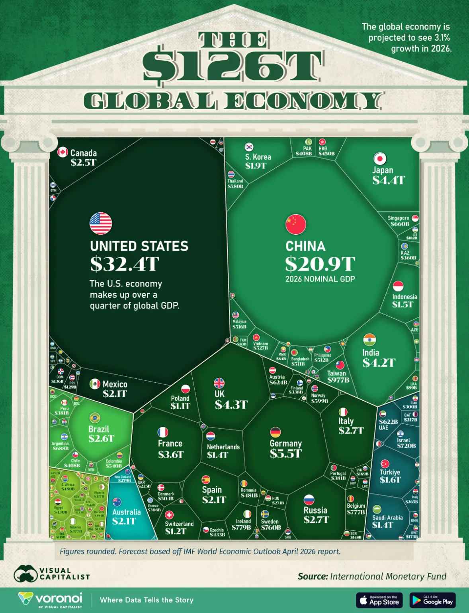

# Overview

This visualization compares the world's top 15 economies by:

1. Total GDP (market size) — horizontal bar chart
2. GDP per capita (individual affluence) — horizontal bar chart
3. Regional GDP share trends (2000–2026) — line chart

**Data sources:** IMF World Economic Outlook (April 2026) and World Bank.

**Output:** Combined multi-panel figure saved as `gdp_redesign.png`.

# The Problem

The original graphic (Visual Capitalist, *The \$126T Global Economy in One Chart*) is a
single-year 2026 treemap. The article claims that economic weight is **shifting toward Asia**, but a one-year snapshot is structurally incapable of showing *change*. The chart asserts a trend it cannot draw.

{height="600px"}

Our redesign, answers three questions the original cannot:

1. **Concentration** — is global output still dominated by a handful of economies?
2. **The shift** — is economic weight moving between regions, specifically toward Asia?
3. **Prosperity** — among the largest economies, which are actually affluent *per person*,
   and who is catching up?

# Data Source

- Nominal GDP: **IMF World Economic Outlook, April 2026**, indicator **`NGDPD`** (*GDP, current prices, USD billions*), exported from the IMF DataMapper as `data/imf-dm-export-20260624.xls`. 
- Population: **World Bank `SP.POP.TOTL`**, supplied as `data/pop_raw.csv` and merged to derive GDP per capita.

# Design Brief

This redesign is intended for economic and trade-policy analysts prioritizing global markets and trade partnerships. The goal is to clearly rank and compare the total absolute market size of individual economies for the year 2026. In addition, it also aims to show that the economic weight is shifting towards Asia since 2000.

- **Revisions:**
  - Side by side horizontal bar chart comparison for nominal GDP and individual affluence
  - Line chart to show the GDP share by region trend
  - Distinct colour palette for each region
  - Standardized units in USD trillions
- **Core Insight:** A higher nominal GDP does not automatically correlate to a higher GDP per capita. Massive market scale (e.g., China or India) often masks lower individual affluence due to population size, while smaller total economies (e.g., Canada or Australia) frequently lead in individual prosperity.
- **Design Rationale:**
  - **Multi-Panel Layout:** Three panels (total GDP, GDP per capita, regional trends) allow simultaneous comparison of market size, prosperity, and structural shifts.
  - **Symmetric Horizontal Bars:** Aligned side-by-side to allow direct, eye-movement-only comparison of total GDP (market size) against GDP per capita (prosperity) for the exact same country rows.
  - **Direct-Labeled Line Chart:** Illustrates the global regional shifts from 2000 to 2026, with forecasts extending to 2030, highlighting the dominant scale of Asia's aggregate economy without legend-lookup clutter.
  - **Unified Region Colors:** A palette links regions across all bar, and line charts.

# Data Cleaning/Transformation

## Setup
```{r}
#| label: data-clean-transformation-setup
library(tidyverse)
library(readxl)
library(countrycode)
library(scales)
```

## Import the raw file

```{r}
#| label: import
raw <- read_excel("data/imf-dm-export-20260624.xls") |>
  rename(entity = 1) # first column holds the economy/aggregate names
dim(raw)
```

## Clean

The export lists the **individual economies first** (Afghanistan → Zimbabwe), followed by
**regional and analytical aggregates** (`Africa`, `Advanced economies`, `G-20`, …, `World`)
and a `©IMF, 2026` footer. Summing the whole column double-counts (it reaches ~\$374T), so we
keep only individual economies, via two defensive steps: (1) cut the table at the first
aggregate row (`Africa`); (2) validate every remaining name against ISO-3 with
`countrycode()`, dropping anything that does not resolve.

```{r}
#| label: clean
# (1) cut at the first regional aggregate -> individual-economy block
first_agg <- which(raw$entity == "Africa")[1]
econ <- raw |>
  slice(1:(first_agg - 1)) |>
  filter(!is.na(entity)) |>
  select(-any_of("Estimates start after"))

# (2) wide -> long over the year columns; parse "no data" -> NA; drop missing
year_cols <- names(econ)[str_detect(names(econ), "^[0-9]{4}$")]
long <- econ |>
  pivot_longer(
    all_of(year_cols),
    names_to = "year",
    values_to = "gdp_usd_bn"
  ) |>
  mutate(
    year = as.integer(year),
    gdp_usd_bn = parse_number(na_if(as.character(gdp_usd_bn), "no data"))
  ) |>
  filter(!is.na(gdp_usd_bn))

# (3) standardise to ISO-3 + UN-M49 region; non-countries -> NA iso3 -> dropped.
#     custom_match covers IMF spellings countrycode can miss.
custom <- c(
  "Türkiye, Republic of" = "TUR",
  "Kosovo" = "XKX",
  "Micronesia, Fed. States of" = "FSM",
  "Lao P.D.R." = "LAO"
)
long <- long |>
  mutate(
    iso3 = countrycode(
      entity,
      "country.name",
      "iso3c",
      custom_match = custom,
      warn = FALSE
    ),
    country = countrycode(iso3, "iso3c", "country.name", warn = FALSE),
    region = countrycode(iso3, "iso3c", "continent", warn = FALSE) # Africa/Americas/Asia/Europe/Oceania
  ) |>
  filter(!is.na(iso3))

# (4) unit transformation: billions -> trillions (one consistent unit)
long <- long |> mutate(gdp_usd_tn = gdp_usd_bn / 1000)

n_distinct(long$iso3) # economies retained
```

## Write Cleaned Datasets

```{r}
#| label: write-clean
dir.create("data", showWarnings = FALSE)

# tidy long form (all years) — the canonical cleaned dataset
gdp_long <- long |>
  select(iso3, country, region, year, gdp_usd_bn, gdp_usd_tn) |>
  arrange(country, year)
write_csv(gdp_long, "data/gdp_clean_long.csv")

# 2026 snapshot used by the redesign
gdp_2026 <- gdp_long |>
  filter(year == 2026) |>
  select(-year) |>
  arrange(desc(gdp_usd_tn))
write_csv(gdp_2026, "data/gdp_clean_2026.csv")

# sanity check: 2026 country total should approximate the IMF "World" row (~$126.3T)
sprintf(
  "2026 economies: %d | total: $%.1fT (IMF World = $126.3T)",
  nrow(gdp_2026),
  sum(gdp_2026$gdp_usd_tn)
)
```

## Transform: GDP per capita

The IMF file is GDP only, so population is joined from the included raw
**World Bank** indicator **`SP.POP.TOTL`** file (`data/pop_raw.csv`) to derive GDP per
capita. Using the submitted raw file makes the complete render reproducible without an
internet connection. Because 2026 population is not yet available, the calculation uses
the latest non-missing population observation and retains its year for transparency.

```{r}
#| label: percapita
pop <- read_csv("data/pop_raw.csv", show_col_types = FALSE) |>
  filter(!is.na(population)) |>
  filter(!is.na(iso3c)) |>
  group_by(iso3c) |>
  slice_max(year, n = 1, with_ties = FALSE) |>
  ungroup() |>
  transmute(iso3 = iso3c, population_year = year, population)

gdp_2026_pc <- gdp_2026 |>
  left_join(pop, by = "iso3") |>
  mutate(gdp_per_capita = gdp_usd_tn * 1e12 / population)

write_csv(gdp_2026_pc, "data/gdp_2026_with_percapita.csv")
gdp_2026_pc |> slice_max(gdp_usd_tn, n = 8)
```

# Data Preparation

## Setup

```{r}
#| label: data-preparation-setup
library(tidyverse)
library(scales)
library(patchwork)
theme_set(theme_minimal(base_size = 12))
```

## Data Preparation for Panel

```{r}
#| label: data-prep

# Data Loading
gdp_2026_pc <- read_csv(
  "data/gdp_2026_with_percapita.csv",
  show_col_types = FALSE
)
gdp_long <- read_csv("data/gdp_clean_long.csv", show_col_types = FALSE)

# Color Palette (ColorBrewer Set1)
region_pal <- brewer_pal(palette = "Set1")
region_colors <- setNames(
  region_pal(5),
  c("Asia", "Americas", "Europe", "Oceania", "Africa")
)

# Top 15 economies by total GDP, ordered for plotting
top_15 <- gdp_2026_pc |>
  slice_max(gdp_usd_tn, n = 15) |>
  mutate(country = fct_reorder(country, gdp_usd_tn)) |>
  mutate(region = factor(region, levels = names(region_colors)))

# Regional GDP share over time (2000–2030)
regional_trend <- gdp_long |>
  filter(!is.na(region), year >= 2000, year <= 2030) |>
  group_by(year, region) |>
  summarize(gdp_usd_tn = sum(gdp_usd_tn), .groups = "drop_last") |>
  mutate(share = gdp_usd_tn / sum(gdp_usd_tn))

# Order regions by 2026 GDP (largest first)
region_order <- regional_trend |>
  filter(year == 2026) |>
  arrange(desc(gdp_usd_tn)) |>
  pull(region)

regional_trend <- regional_trend |>
  mutate(region = factor(region, levels = region_order))
```

## Panel A: Market Size (Total GDP)

The United States and China dominate the global landscape. While the US maintains the top position at $32.4T, China follows closely at $20.9T, with a significant drop-off to the next tier of economies like Germany and Japan.

```{r}
#| label: plot-a
plot_a <- ggplot(top_15, aes(x = gdp_usd_tn, y = country, fill = region)) +
  geom_col(width = 0.75, show.legend = FALSE) +
  geom_text(
    aes(label = sprintf("$%.1fT", gdp_usd_tn)),
    hjust = -0.15,
    color = "gray20",
    fontface = "bold",
    size = 3.2
  ) +
  scale_x_continuous(
    expand = expansion(mult = c(0, 0.15)),
    labels = label_dollar(suffix = "T")
  ) +
  scale_fill_manual(values = region_colors) +
  labs(
    title = "Panel A: Market Size (Nominal GDP)",
    subtitle = "Top 15 economies in 2026 (USD Trillions)",
    x = "GDP in 2026",
    y = NULL
  ) +
  theme_minimal(base_size = 11) +
  theme(
    panel.grid.major.y = element_line(color = "gray90", linewidth = 0.3),
    panel.grid.minor = element_blank(),
    plot.title = element_text(face = "bold", size = 12),
    plot.subtitle = element_text(color = "gray40", size = 10),
    axis.text.y = element_text(face = "bold", color = "gray20", size = 10)
  )

plot_a
```

## Panel B: Individual Affluence (GDP per capita)

Contrasting market size with individual affluence reveals a sharp divide. While the US and European nations maintain high GDP per capita (prosperity), the emerging giants China and India show significantly lower per-capita figures. This highlights that massive market scale does not yet equate to the same level of individual wealth found in established advanced economies.

```{r}
#| label: plot-b
plot_b_affluence <- ggplot(
  top_15,
  aes(x = gdp_per_capita, y = country, fill = region)
) +
  geom_col(width = 0.75, show.legend = FALSE) +
  geom_text(
    aes(label = sprintf("$%.1fk", gdp_per_capita / 1000)),
    hjust = -0.15,
    color = "gray20",
    fontface = "bold",
    size = 3.2
  ) +
  scale_x_continuous(
    expand = expansion(mult = c(0, 0.2)),
    labels = label_dollar(scale = 0.001, suffix = "k")
  ) +
  scale_fill_manual(values = region_colors) +
  labs(
    title = "Panel B: Individual Affluence",
    subtitle = "GDP per capita in 2026 (USD)",
    x = "GDP per capita",
    y = NULL
  ) +
  theme_minimal(base_size = 11) +
  theme(
    panel.grid.major.y = element_line(color = "gray90", linewidth = 0.3),
    panel.grid.minor = element_blank(),
    plot.title = element_text(face = "bold", size = 12),
    plot.subtitle = element_text(color = "gray40", size = 10),
    axis.text.y = element_blank()
  )

plot_b_affluence
```

## Panel C: Regional GDP Share Trends

The "Shift to Asia" is most evident when examining regional shares over time. Since 2000, Asia's share of global GDP has risen, surpassing both the Americas and Europe. This structural transformation underscores the migration of global economic gravity toward the East.

```{r}
#| label: plot-c
# Mark the boundary between historical values and projections
label_data <- regional_trend |>
  filter(year == 2026)

plot_c_trends <- ggplot(
  regional_trend,
  aes(x = year, y = share, color = region, group = region)
) +
  geom_line(
    data = regional_trend |> filter(year <= 2026),
    linewidth = 1.2,
    show.legend = FALSE
  ) +
  geom_line(
    data = regional_trend |> filter(year >= 2026),
    linewidth = 1.2,
    linetype = "dotted",
    show.legend = FALSE
  ) +
  geom_point(data = label_data, size = 2.0, show.legend = FALSE) +
  scale_x_continuous(
    limits = c(2000, 2030),
    breaks = c(2000, 2005, 2010, 2015, 2020, 2026, 2030),
    expand = expansion(mult = c(0.02, 0))
  ) +
  scale_y_continuous(
    labels = label_percent(),
    breaks = seq(0, 0.4, by = 0.1)
  ) +
  scale_color_manual(values = region_colors) +
  labs(
    title = "Panel C: Global GDP Share by Region (2000-2030)",
    subtitle = "Regional GDP share; dotted: 2026–2030 projections",
    x = "Year",
    y = "Share of World GDP"
  ) +
  theme_minimal(base_size = 11) +
  theme(
    panel.grid.minor = element_blank(),
    plot.title = element_text(face = "bold", size = 12),
    plot.subtitle = element_text(color = "gray40", size = 10)
  )

plot_c_trends
```

# Final Dashboard Assembly

The final figure combines all insights into a single unified dashboard, facilitating multi-dimensional analysis of global economic power.

```{r}
#| label: dashboard-combine
#| fig-width: 14
#| fig-height: 6.5

# Legend plot (one row per region for the legend keys)
legend_data <- tibble(region = names(region_colors))
region_legend <- ggplot(legend_data, aes(x = 1, y = 1, fill = region)) +
  geom_tile(alpha = 0) +
  scale_fill_manual(values = region_colors, drop = FALSE) +
  guides(
    fill = guide_legend(
      nrow = 1,
      title = "Region",
      title.position = "top",
      override.aes = list(alpha = 1)
    )
  ) +
  theme_void() +
  theme(
    legend.position = "bottom",
    legend.key.spacing.x = unit(0.8, "cm"),
    legend.title = element_text(hjust = 0.5),
    legend.margin = margin(t = 3, b = 3),
    plot.margin = margin(0, 0, 0, 0)
  )

combined_plot <- plot_a +
  plot_b_affluence +
  plot_c_trends +
  region_legend +
  plot_layout(
    design = "
      AAABBBCCC
      AAABBBCCC
      ##DDDDD##
    ",
    heights = c(1, 1, 0.14)
  ) +
  plot_annotation(
    title = "Redesigning the Global Economy: Market Size, Trends, and Individual Affluence",
    subtitle = "A comparison of the world's top 15 economies (2026) and regional GDP share (2000-2030)",
    caption = "Data Source: IMF World Economic Outlook (April 2026) & World Bank Population Data.",
    theme = theme(
      plot.title = element_text(
        size = 18,
        face = "bold",
        hjust = 0,
        margin = margin(b = 5)
      ),
      plot.subtitle = element_text(
        size = 12,
        hjust = 0,
        color = "gray30",
        margin = margin(b = 20)
      ),
      plot.caption = element_text(
        size = 9,
        color = "gray50",
        margin = margin(t = 15)
      )
    )
  )

ggsave("gdp_redesign.png", combined_plot, width = 14, height = 6.5, dpi = 300)

combined_plot
```

# References
1. International Monetary Fund (2026). *World Economic Outlook Database: April 2026*. Indicator: Gross Domestic Product, current prices (NGDPD). Available at: <https://www.imf.org/external/datamapper/NGDPD@WEO/WEOWORLD>
2. World Bank Group (2026). *World Development Indicators*. Indicator: Population, total (SP.POP.TOTL). Available via API query endpoints at: <https://databank.worldbank.org/source/world-development-indicators>
3. Visual Capitalist (2026). *The $126T Global Economy in One Chart*. Available at: <https://www.visualcapitalist.com/the-126t-global-economy-in-one-chart/>
